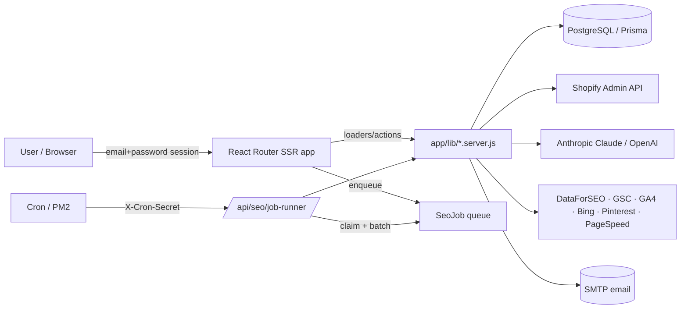

# Kimono SEO

[](LICENSE)
[](LICENSING.md)
[](https://reactrouter.com/)
[](https://www.anthropic.com/)
[](https://www.postgresql.org/)
[](https://nodejs.org/)

**Kimono SEO** is a self-hosted, AI-driven SEO automation platform for Shopify stores (with partial WooCommerce support). You connect a store via OAuth, and an autonomous "SEO engine" syncs the catalog, discovers keywords, proposes a collection taxonomy, runs on-page audits, generates blog content and structured data, manages redirects, and tracks how the store is cited by AI assistants (GEO).

It is a **standalone application** — not an embedded Shopify app — with its own email/password auth and DB-backed sessions. It is designed to be run on your own server, using **your own API keys** (Anthropic, Shopify, Google, DataForSEO, etc.).

> This is the open-source project. Kimono Group also offers a separate **commercial license** and **paid support** — see [Commercial & Support](#commercial--support).

---

## Key features

Features are grouped below. Most modules are exposed both as UI pages under `/app/*` and as JSON action endpoints under `/api/*` (see [docs/API.md](docs/API.md)).

### Core SEO engine (catalog → keywords → taxonomy → tags)
- **Product sync** — pulls the Shopify (or WooCommerce) catalog into local `SeoProduct` rows and keeps them fresh via product webhooks and a nightly reconcile job.
- **AI keyword discovery** — extracts keyword candidates with Claude, optionally enriched with search volume / difficulty / CPC / SERP data from DataForSEO and mined from Google Search Console.
- **Taxonomy & collection proposals** — Claude proposes an L1/L2/L3 tag and collection structure; approved proposals create Shopify smart collections and apply tags.
- **Background job queue** — a self-triggering job runner processes `SYNC / EXTRACT / ENRICH / TAG / TAXONOMY / AUDIT` jobs in batches using row-level locking, with progress tracking and an "auto-pilot" orchestrator.

### On-page & technical SEO
- **On-page audits** — per-product scoring across meta title, meta description, H1, handle, images, and Open Graph, plus entity coverage.
- **Redirect manager** — detects 404s (from GSC + sitemap) and suggests/creates Shopify URL redirects.
- **Robots.txt & crawl budget** — audits AI-crawler access and robots directives, with apply-to-theme support.
- **Core Web Vitals** — LCP / CLS / FCP / TTFB / TBT / SI via Google PageSpeed Insights, with AI recommendations.
- **Schema / JSON-LD** — generates and validates product, Organization, FAQ, and BlogPosting structured data.
- **IndexNow & llms.txt** — instant URL submission to Bing/Copilot/Yandex and a generated `llms.txt` for AI crawlers.

### AI content generation
- **Blog / article generation** — AI-written articles with title, meta, primary keyword, internal linking, banner prompts, and a content calendar.
- **Content decay & refresh** — detects decaying articles and regenerates/updates them.
- **FAQ / People-Also-Ask** — builds FAQ blocks from PAA data.
- **Programmatic SEO (pSEO)** — template + row driven page generation with scheduled/drip publishing.
- **Image alt-text (Vision)** — generates alt text using Claude Vision.

### GEO / AI-citation tracking
- **AI citations** — measures how often the store's brand is cited by AI answers; ChatGPT citation measurement uses OpenAI, other analysis uses Claude.
- **Brand SERP & Organization schema**, **LLM sentiment**, **citation monitor**, **answer confidence**, **topical authority**, **entity SEO**, **E-E-A-T**, **zero-click / featured-snippet** optimization, **competitor gap**, **cannibalization**, and **intent-shift** analysis.

### Integrations & analytics
- **Google Search Console** (search analytics, query mining, 404 detection).
- **Google Analytics 4** (referral traffic from AI assistants).
- **Bing Webmaster** (site stats, URL submission) and **Pinterest** (boards, pins, scheduled auto-posting).
- **Weekly email digest** and transactional auth emails via SMTP (nodemailer).

> **Plans are feature-gating only.** `app/lib/billing.js` is a static plan catalog (FREE / STARTER / GROWTH / SCALE) and `plan-gate.server.js` redirects blocked modules to `/app/billing`. **No payment processor is wired in this project** — there is no Stripe or checkout. Self-hosters can adjust gating in code.

---

## Tech stack

| Layer | Technology |
| --- | --- |
| Framework | [React Router v7](https://reactrouter.com/) (framework mode, SSR via `renderToPipeableStream`) |
| Runtime | Node.js `>=20.19 <22 || >=22.12` |
| Database / ORM | PostgreSQL + [Prisma](https://www.prisma.io/) |
| Auth | Self-contained email/password (`bcryptjs`) with DB-backed sessions |
| AI | [Anthropic Claude](https://www.anthropic.com/) (primary) · OpenAI (ChatGPT citation measurement only) |
| Email | SMTP via `nodemailer` |
| Headless rendering | `puppeteer-core` + `@sparticuz/chromium` |
| UI | React 18, `lucide-react` icons, plain CSS (`global.css`, no Tailwind) |
| Process manager | PM2 (`ecosystem.config.cjs`) |

> The package name in `package.json` is `business-intelligence-ai` (legacy) — this repository is Kimono SEO.

---

## Architecture overview

Kimono SEO is a single React Router SSR application. Route loaders/actions live in `app/routes/*`; business logic lives in `*.server.js` library modules under `app/lib/` (notably `app/lib/seo/`, `app/lib/integrations/`, and `app/lib/auth/`). All state is persisted in PostgreSQL through Prisma. Long-running work is decoupled from web requests via a **job queue** (`SeoJob`): API actions enqueue jobs, and a secret-protected **job runner** endpoint claims and processes them in batches, re-triggering itself until the queue drains. External schedulers (cron / PM2) call the `/api/seo/*` cron endpoints using a shared `CRON_SECRET`.



For a full component and data-flow breakdown, see [docs/ARCHITECTURE.md](docs/ARCHITECTURE.md).

---

## Quick start

> 🤖 **Prefer to let AI install it?** See **[docs/INSTALL_WITH_CLAUDE_CODE.md](docs/INSTALL_WITH_CLAUDE_CODE.md)** — connect [Claude Code](https://claude.com/claude-code) to your server and it runs the whole setup for you, asking for your own keys as it goes.

> Full, step-by-step instructions (including all environment variables and external OAuth setup) are in **[docs/INSTALLATION.md](docs/INSTALLATION.md)** and **[docs/CONFIGURATION.md](docs/CONFIGURATION.md)**. The steps below are the short path.

**Prerequisites:** Node.js `>=20.19` (see `engines`), a PostgreSQL database, and at minimum an Anthropic API key.

```bash
# 1. Clone
git clone https://github.com/danielbirtas/kimono-seo.git
cd kimono-seo

# 2. Install dependencies
npm install

# 3. Configure environment
cp .env.example .env   # then edit .env — see docs/CONFIGURATION.md
# Required at minimum: DATABASE_URL, CRON_SECRET, ANTHROPIC_API_KEY
# APP_URL is also required in practice (used to build email verify/reset links).
# Note: SESSION_SECRET is not read anywhere — sessions are DB-backed opaque cuid tokens.

# 4. Set up the database (Prisma)
npm run db:migrate     # prisma migrate deploy
npm run seed           # creates the initial SUPER_ADMIN (ADMIN_EMAIL / ADMIN_PASSWORD)

# 5. Build and run
npm run build
npm run start          # serves ./build/server/index.js on PORT (default 3000)
```

For local development, use `npm run dev` (see [CONTRIBUTING.md](CONTRIBUTING.md)). For production process management, a PM2 config is provided in `ecosystem.config.cjs`.

> **Security note:** change the seeded admin password immediately, and never commit real secrets. Example values in the docs (e.g. `sk-ant-xxxx`, `GOCSPX-xxxx`, `changeme`) are placeholders.

---

## Documentation

| Document | Contents |
| --- | --- |
| [docs/INSTALLATION.md](docs/INSTALLATION.md) | Prerequisites, install, database setup, first run |
| [docs/CONFIGURATION.md](docs/CONFIGURATION.md) | All environment variables and external service / OAuth setup |
| [docs/ARCHITECTURE.md](docs/ARCHITECTURE.md) | System design, modules, job queue, and data flow |
| [docs/API.md](docs/API.md) | HTTP endpoints (`/api/*`), pages (`/app/*`), and cron routes |
| [CONTRIBUTING.md](CONTRIBUTING.md) | Local dev setup, coding conventions, issues/PRs, and the CLA |
| [LICENSING.md](LICENSING.md) | AGPL-3.0, the commercial dual-license, and support tiers |
| [LICENSE](LICENSE) | Full GNU AGPL-3.0 license text |

---

## Install with Claude Code

Most self-hosters connect to their server with **[Claude Code](https://claude.com/claude-code)**
(Anthropic's agentic CLI) and let it run the whole install. SSH into your server, then:

```bash
npm install -g @anthropic-ai/claude-code    # install Claude Code
git clone https://github.com/danielbirtas/kimono-seo.git
cd kimono-seo
claude                                       # start Claude Code in the project
```

Then paste this prompt to Claude:

```text
Install and run Kimono SEO on this server by following docs/INSTALLATION.md and
docs/CONFIGURATION.md. Check prerequisites, create the PostgreSQL database, copy
.env.example to .env and ask me for each value (my own API keys and secrets — never
commit them), run the Prisma migrations, build, start it (PM2 if available), seed the
admin account, and give me the login URL. Explain each command before running it.
```

You provide **your own** API keys when Claude asks — nothing secret is ever committed.
Full walkthrough: **[docs/INSTALL_WITH_CLAUDE_CODE.md](docs/INSTALL_WITH_CLAUDE_CODE.md)**.

---

## Commercial & Support

Kimono SEO is free to self-host and use, including commercially, under the terms of AGPL-3.0.

- **Community support (free):** open a [GitHub issue](../../issues). Best-effort, no SLA.
- **Paid support & services (from Kimono Group):** priority support with an SLA, installation & upgrade assistance, managed hosting, and custom development. Tiers are described generically in [LICENSING.md](LICENSING.md) — no prices are published here.
- **Commercial license:** if you want to use Kimono SEO inside a closed/proprietary product without AGPL obligations, a separate commercial license is available. See [LICENSING.md](LICENSING.md).

Contact: **office@kimonogroup.ro** *(placeholder — the maintainer can change this)*.

---

## License

Kimono SEO is licensed under the **GNU Affero General Public License v3.0 only (AGPL-3.0-only)**. Copyright (C) 2026 Kimono Group. The full text is in [LICENSE](LICENSE).

In short: you may self-host and use it for free, including commercially. **However, because it is AGPL, if you modify it and run it as a network service (SaaS), section 13 requires you to publish your complete corresponding source — including your modifications — to the users of that service.**

A **commercial dual-license** is available from Kimono Group for use in closed/proprietary products without the AGPL obligations. See [LICENSING.md](LICENSING.md) and contact **office@kimonogroup.ro**.

The companion WooCommerce connector plugin (`kimono-bi-woo-plugin`) is licensed separately under **GPL-2.0-or-later** (a WordPress requirement).
