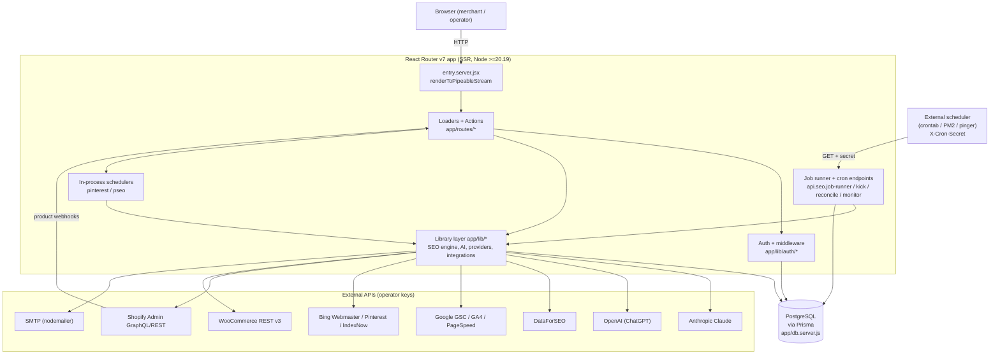
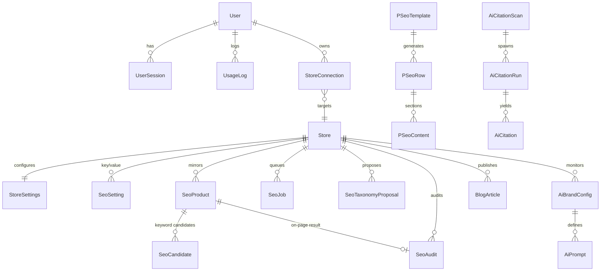
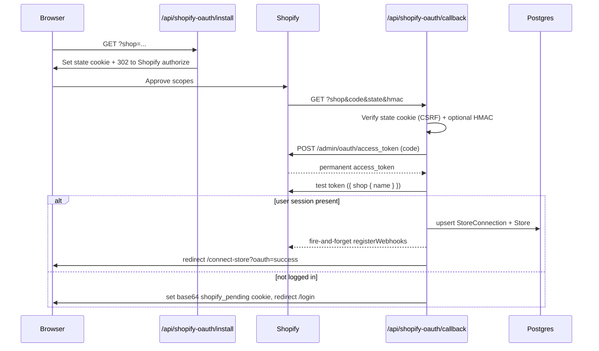

# Architecture

This document describes the internal architecture of **Kimono SEO** — a standalone,
self-hosted AI SEO automation platform for Shopify (with partial WooCommerce support).
It is intended for developers who want to understand, operate, or extend the codebase.

Every claim here is traceable to the source under `app/`, `prisma/`, and `scripts/`.
For setup and tuning see [INSTALLATION.md](INSTALLATION.md) and
[CONFIGURATION.md](CONFIGURATION.md); for the HTTP surface see [API.md](API.md).

> **Naming note.** The product and the `package.json` `name` field are both
> *Kimono SEO* (`kimono-seo`). The repo folder is referred to as `kimono-bi` in
> some internal references.

---

## 1. High-level overview

Kimono SEO is a **React Router v7 framework-mode** app (SSR) backed by
**Prisma + PostgreSQL**. It is *not* an embedded Shopify app: the SSR entry
(`app/entry.server.jsx`) stubs out Shopify document headers, legacy Shopify auth routes
redirect to `/login`, and most Shopify webhooks are neutralized stubs. Authentication is
a self-contained email/password system with opaque, DB-backed session tokens.

The system has four cooperating layers:

1. **Web / SSR layer** — React Router loaders (reads) and actions (writes) rendered
   server-side via `renderToPipeableStream`. Authenticated UI lives under `/app/*`;
   JSON resource routes live under `/api/*`.
2. **Library layer** (`app/lib/*`) — all business logic: auth, the SEO engine
   (job queue + processors), external data-provider clients, AI/content modules, and
   commerce integrations.
3. **Persistence** — a single PostgreSQL database accessed through a retry-wrapped Prisma
   client (`app/db.server.js`).
4. **Background work** — a self-triggering job runner plus a set of cron/worker HTTP
   endpoints (authenticated by a shared `CRON_SECRET`) and in-process schedulers.

External services are all reached over HTTPS with keys supplied by the operator:
Anthropic Claude (primary AI), OpenAI (ChatGPT citation measurement only), DataForSEO
(keyword/SERP data), Google Search Console, GA4, Bing Webmaster, Google PageSpeed
Insights, Pinterest, IndexNow, and SMTP for transactional email.



### Runtime & process model

| Concern            | Detail                                                                                             |
| ------------------ | -------------------------------------------------------------------------------------------------- |
| Framework          | React Router v7 framework mode (SSR); routes via `flatRoutes()` over `app/routes/*`                 |
| SSR entry          | `app/entry.server.jsx` — streams with `renderToPipeableStream`, bot detection via `isbot`          |
| Runtime            | Node.js `>=20.19 <22 || >=22.12`                                                                    |
| ORM / DB           | Prisma 6 + PostgreSQL; retry wrapper for transient errors in `app/db.server.js`                    |
| Process manager    | PM2 cluster (`ecosystem.config.cjs`) running `@react-router/serve` on `PORT` (default 3000)        |
| Headless rendering | `puppeteer-core` + `@sparticuz/chromium` (used by rendering/audit paths)                            |
| Styling            | Plain CSS (`public/global.css`); no Tailwind                                                        |

---

## 2. Project structure

Only the load-bearing directories are shown. One-line purposes are drawn from the code.

```text
kimono-bi/
├─ app/
│  ├─ root.jsx                     # HTML document shell (Meta/Links/Outlet/Scripts)
│  ├─ entry.server.jsx             # SSR entry; Shopify header stub; stream timeout
│  ├─ routes.js                    # flatRoutes() FS routing config
│  ├─ db.server.js                 # Prisma singleton + transient-error retry ($extends)
│  ├─ routes/                      # ~128 route modules (see below)
│  ├─ components/                  # Shared UI (HubLayout, FeatureGate, CommandPalette, ...)
│  ├─ utils/                       # safe-loader helper
│  └─ lib/
│     ├─ anthropic.server.js       # Shared Claude Messages API wrapper (retry/backoff)
│     ├─ billing.js                # Client-safe plan catalog (Plan: FREE/STARTER/GROWTH/SCALE)
│     ├─ plan-gate.server.js       # Route->module gating (called from app.jsx loader)
│     ├─ trial-limits.server.js    # Per-store trial usage caps (SeoSetting counters)
│     ├─ rate-limit.server.js      # In-memory sliding-window limiter (auth routes)
│     ├─ log.server.js             # Structured, grep-friendly logger
│     ├─ webhook-verify.server.js  # Per-store URL-secret webhook verification
│     ├─ shopify-webhooks.server.js# Register/deregister Shopify product webhooks
│     ├─ auth/                     # Self-contained email/password auth (see §3.1)
│     ├─ integrations/
│     │  ├─ shopify/client.server.js      # Token-based Admin GraphQL client (API 2025-01)
│     │  └─ woocommerce/client.server.js  # WooCommerce REST v3 client (Basic auth)
│     └─ seo/                      # The "SEO engine" — ~70 modules (see §3.2–§3.5)
│        ├─ job-processor.server.js       # In-process detached-Promise job processor
│        ├─ job-recovery.server.js        # Zombie-job recovery + auto-resume
│        ├─ discovery-orchestrator.server.js  # Bridges 5-source discovery -> Enrich
│        ├─ keyword-discovery.server.js   # 5-source keyword candidate discovery
│        ├─ keyword-selector.server.js    # Anti-cannibalization keyword allocator
│        ├─ ecs-scorer.server.js          # Expected Click Score algorithm
│        ├─ taxonomy.server.js            # AI taxonomy decisions (Claude)
│        ├─ apply-proposal.server.js      # Apply taxonomy -> Shopify collections/tags
│        ├─ onpage-audit.server.js        # AUDIT job entry point
│        ├─ audit-processor.server.js     # Audit + auto-optimize + description writer
│        ├─ redirect-manager.server.js    # 404 detection + redirect apply
│        ├─ article-generator.server.js   # AI blog article generation + publish
│        ├─ schema-generator.server.js    # Product JSON-LD builder
│        ├─ llmstxt-generator.server.js   # llms.txt generation + publish
│        ├─ programmatic-seo.server.js    # pSEO templates/rows/content + publish
│        ├─ ai-citations/               # Multi-platform GEO citation scans (see §3.4)
│        ├─ dataforseo.server.js + dfs-cache.server.js  # DataForSEO client + 30d cache
│        ├─ gsc*.server.js               # Google Search Console OAuth + sync + triage
│        ├─ ga4-traffic.server.js        # GA4 AI-referral traffic
│        ├─ bing-*.server.js             # Bing Webmaster OAuth + legacy API-key stub
│        ├─ core-web-vitals.server.js    # PageSpeed / Lighthouse CWV audit
│        ├─ pinterest-*.server.js        # Pinterest OAuth + pins + scheduler
│        ├─ indexnow.server.js           # IndexNow submission + key file
│        ├─ oauth-state.server.js        # CSRF-safe OAuth state for Bing/Pinterest/GSC/GA4
│        ├─ session-helper.server.js     # Offline Shopify token refresh for jobs
│        ├─ settings.server.js / constants.js  # SeoSetting helpers + engine constants
│        ├─ skill/*.md                   # Prompt/skill files used as AI system prompts
│        └─ synonyms-ro.json / stop-words-ro.json  # RO NLP data
├─ prisma/
│  ├─ schema.prisma                # ~50 models + 11 enums (PostgreSQL)
│  ├─ seed.js                      # Seeds SUPER_ADMIN; exports PLAN_LIMITS + calcCost
│  └─ migrations/                  # 21 migration folders (applied via migrate deploy)
├─ scripts/
│  └─ cron-seo-digest.js           # Weekly digest email (run from crontab)
├─ skills/                         # Additional skill/prompt assets
├─ ecosystem.config.cjs            # PM2 cluster config
└─ docs/                           # This documentation set
```

### Route families (`app/routes/`)

| Prefix                     | Kind                | Purpose                                                                                  |
| -------------------------- | ------------------- | ---------------------------------------------------------------------------------------- |
| `login`, `register`, `reset*`, `verify_*`, `resend`, `logout` | Public auth | Email/password flows; rate-limited                                    |
| `app.jsx` + `app.*.jsx`    | Authenticated UI    | App shell + ~44 feature pages; `app.jsx` loader is the plan-gate enforcement point        |
| `api.*.js`                 | Resource routes     | ~45 JSON loaders/actions; user routes use `requireAuth`, cron routes use `CRON_SECRET`   |
| `webhooks.*.jsx`           | Shopify webhooks    | `products.create/update/delete` are functional; the rest are 200 stubs                   |
| `*-callback.jsx`           | OAuth callbacks     | `gsc-callback`, `ga4-callback` (Shopify OAuth callback is under `api.shopify-oauth.*`)    |
| `pricing`, `legal.*`, `privacy` | Marketing/legal | Static, no loader                                                                        |

---

## 3. Module catalog

### 3.1 Authentication (`app/lib/auth/`)

A self-contained email/password system — no Shopify session, no JWT.

| Module                 | Responsibility                                                                                              |
| ---------------------- | ---------------------------------------------------------------------------------------------------------- |
| `session.server.js`    | Opaque DB-backed sessions. Cookie `kimono_session`, 30-day expiry, `HttpOnly`, `SameSite=Lax`. Creates/deletes `UserSession` rows. |
| `password.server.js`   | `bcryptjs` hashing/verification, `SALT_ROUNDS=12`.                                                          |
| `middleware.server.js` | `requireAuth(request)` → `{ user, connection, store, storeId }` (loads active `StoreConnection`, find-or-creates `Store`); `requireGuest`. |
| `email.server.js`      | `nodemailer` SMTP for verify/reset emails; config read at call time; links built from `APP_URL`.           |
| `plan-guard.server.js` | User-plan (`UserPlan`) feature guard + LLM cost logging via `UsageLog`. **Note:** exports appear unwired in the routes reviewed. |
| `index.server.js`      | Barrel re-export of the above.                                                                              |

Two parallel plan systems coexist and use **different enum sets**:

- **Store-level** `Plan` (`FREE/STARTER/GROWTH/SCALE`) — catalog in `app/lib/billing.js`,
  enforced by `plan-gate.server.js` from the `app.jsx` loader. This is a **feature-gating
  catalog only**; there is *no* payment processor and *no* `/app/billing` route (the gate's
  redirect target does not exist).
- **User-level** `UserPlan` (`TRIAL/STARTER/GROWTH/AGENCY/ADMIN`) — limits in
  `prisma/seed.js` `PLAN_LIMITS`, consumed by `plan-guard.server.js`.

Trial usage caps (`trial-limits.server.js`) are genuinely enforced in a few feature paths
(AI citations, programmatic SEO, Pinterest) using `SeoSetting` counters.

### 3.2 SEO engine — pipeline & job queue (`app/lib/seo/`)

The "Brain": a background pipeline that syncs the catalog, discovers/enriches keywords,
generates taxonomy and on-page proposals, and applies approved changes to Shopify.

Jobs are `SeoJob` rows with a `JobType`
(`SYNC`, `EXTRACT`, `ENRICH`, `TAG`, `TAXONOMY`, `AUDIT`, `PAA_BATCH`) and a `JobStatus`
(`QUEUED`, `RUNNING`, `DONE`, `FAILED`, `CANCELLED`). **Two execution engines** exist:

| Engine | File | Claims / handles | Auth |
| ------ | ---- | ---------------- | ---- |
| HTTP self-triggering runner | `app/routes/api.seo.job-runner.js` | `SYNC/EXTRACT/ENRICH/TAG/TAXONOMY` via `FOR UPDATE SKIP LOCKED`; re-triggers itself until done | `X-Cron-Secret` |
| In-process detached-Promise processor | `app/lib/seo/job-processor.server.js` | Same types **plus** `AUDIT` and `PAA_BATCH` | Called from routes/recovery |

> The two engines have overlapping-but-not-identical batch logic (e.g. differing TAXONOMY
> selection keys and default models). Treat this as a known duplication when modifying.

Supporting modules: `job-recovery.server.js` (cancels zombie `RUNNING` jobs at boot and
every 5 min, auto-resumes idempotent `EXTRACT`/`TAG`), `discovery-orchestrator.server.js`,
`keyword-discovery.server.js` (fuses 5 sources: AI extract with a cross-store
`SeoAiExtractCache`, pattern n-grams, RO synonyms, GSC mining, cross-product borrowing),
`ecs-scorer.server.js` + `keyword-selector.server.js` (Expected Click Score +
anti-cannibalization allocation), `taxonomy.server.js` + `apply-proposal.server.js`,
`onpage-audit.server.js` + `audit-processor.server.js`, and `redirect-manager.server.js`.

### 3.3 External data-provider clients (`app/lib/seo/`)

All are thin HTTPS clients; credentials come from env or per-store `SeoSetting`.

| Provider | Module(s) | Auth | Notes |
| -------- | --------- | ---- | ----- |
| DataForSEO | `dataforseo.server.js`, `dfs-cache.server.js` | Basic (`DATAFORSEO_LOGIN/PASSWORD`, env-only) | Keyword volume/ideas/SERP/PAA; 30-day `DfsCache` |
| Google Search Console | `gsc.server.js`, `gsc-sync.server.js`, `gsc-triage.server.js` | OAuth2 refresh token (per-store `SeoSetting`) | Search Analytics; keyword triage |
| Google Analytics 4 | `ga4-traffic.server.js` | OAuth2 (reuses GSC client) | AI-referral traffic monitoring |
| Google Keyword Planner | `gkp.server.js` | OAuth2 + developer token | Caller-supplied config; **appears unused** |
| Bing Webmaster | `bing-oauth.server.js`, `bing-webmaster.server.js` | OAuth2 (Entra) rotating refresh | URL submission, stats |
| Bing (legacy) | `bing-ai-performance.server.js` | API key (per-store) | Stub; AI endpoints not yet released |
| PageSpeed Insights | `core-web-vitals.server.js` | Optional `PAGESPEED_API_KEY` | Core Web Vitals; AI recs via Claude |
| IndexNow | `indexnow.server.js` | Self-generated key file `/{key}.txt` | No provider key needed |
| Pinterest | `pinterest-oauth.server.js`, `pinterest-seo.server.js`, `pinterest-scheduler.server.js` | OAuth2 rotating refresh | Pins/boards + scheduled posting |

OAuth CSRF for Bing/Pinterest/GSC/GA4 is handled by `oauth-state.server.js`
(nonce stored in `SeoSetting`, `.myshopify.com` domain required).

### 3.4 AI / content modules (`app/lib/seo/`, `app/lib/seo/ai-citations/`)

Three provider families:

- **Anthropic Claude (primary)** — articles, JSON-LD schema enrichment, entity / E-E-A-T /
  topical / zero-click / answer-confidence audits, image alt-text (Claude Vision), title
  normalization, fan-out queries, GEO recommendations, llms.txt enrichment, pSEO content.
  Model selection via `AI_MODEL_QUALITY` (default `claude-sonnet-4-6`) and `AI_MODEL_FAST`
  (default `claude-haiku-4-5-20251001`). A shared retry wrapper exists at
  `app/lib/anthropic.server.js` but most modules re-implement the raw fetch.
- **OpenAI (ChatGPT)** — `ai-citations/openai-client.server.js` only, for measuring
  ChatGPT brand citations (`AI_MODEL_OPENAI`, default `gpt-4o`; disabled if
  `OPENAI_API_KEY` unset).
- **DataForSEO** — SERP-driven analyzers (brand SERP, FAQ/PAA, competitor gap, intent
  shift, LLM sentiment, citation monitor, zero-click features, topical authority).

The **AI-Citations (GEO)** sub-package (`ai-citations/`) orchestrates multi-platform
brand-visibility scans (`claude` / `chatgpt` / `aio`), extracts citations and brand
mentions, and computes bootstrap-CI citation rates and share-of-voice — persisted to
`AiCitationScan` / `AiCitationRun` / `AiCitation`.

> Many analyzers persist results as JSON blobs in the `SeoSetting` key/value table rather
> than dedicated tables. Several audit modules hardcode a `claude-sonnet-4-5` model id;
> validate model ids against your Anthropic account before running.

### 3.5 Commerce integrations (`app/lib/integrations/`, `app/lib/seo/`)

| Platform | Client | Auth | Capabilities |
| -------- | ------ | ---- | ------------ |
| Shopify | `integrations/shopify/client.server.js`, `seo/shopify-graphql.server.js`, `seo/shopify.server.js` | `X-Shopify-Access-Token` (OAuth or manual paste) | Read products/collections; write tags, smart collections, `seo{title,description}`, `bodyHtml`, image alt, redirects, metafields; register/deregister webhooks |
| WooCommerce | `integrations/woocommerce/client.server.js` | HTTP Basic (`ck:cs`) | Validate creds, fetch products, apply SEO (title/slug/Yoast meta/alt) |

Shopify Admin API versions are **inconsistent across files** (`2025-01` in the token-based
client, `2025-04` in the hardened GraphQL wrapper and inline fetches). Background jobs get
their token from `StoreConnection.accessToken` or a refreshed offline `Session` via
`session-helper.server.js`.

---

## 4. Data model overview

The schema (`prisma/schema.prisma`) has **~50 models and 11 enums** on a single PostgreSQL
datasource. Nearly every SEO record is scoped to a `Store` with `onDelete: Cascade`. The
models group into the following domains (representative models only — not every field).

| Domain | Key models | Notes |
| ------ | ---------- | ----- |
| **Auth & plans** | `User`, `UserSession`, `UsageLog`, `StoreConnection`, `Store`, `StoreSettings`, `SeoSetting`, `Session` (legacy) | `User.plan` uses `UserPlan`; `Store.plan` uses `Plan` (distinct enums). `SeoSetting` is a generic per-store key/value store used widely. |
| **Catalog & keywords** | `SeoProduct`, `SeoCandidate`, `SeoKeyword`, `SeoAiExtractCache`, `DfsCache`, `SeoSyncLog` | Product mirror + discovered/enriched keyword candidates + caches. |
| **Job pipeline** | `SeoJob`, `SeoDecisionLog`, `SeoAlert` | Queue/state, decision audit trail, unified alerts. |
| **Taxonomy & on-page** | `SeoTaxonomyProposal`, `SeoAudit`, `SeoOptimizeSuggestion`, `SeoSchema`, `SeoSchemaValidation` | Proposals, per-product audits, generated schema. |
| **Advanced audits** | `SeoEntityAudit`, `SeoEEATAudit`, `SeoTopicalMap`, `SeoZeroClickOpt`, `SeoAnswerConfidence`, `SeoImageAlt`, `Seo404Detection` | The "OpenCLAW" audit batch. |
| **Search-data** | `SeoGscData`, `GscTriageResult`, `RedirectSuggestion` | GSC ingestion, triage, 404→redirect suggestions. |
| **Content & pSEO** | `BlogArticle`, `BlogCluster`, `BlogRecommendation`, `LlmsTxt`, `LlmsTxtHistory`, `FanOutSession`, `PSeoTemplate`, `PSeoRow`, `PSeoContent`, `PSeoPublishBatch`, `SeoAuthor` | Blog generation, llms.txt, programmatic SEO. |
| **AI citations (GEO)** | `AiBrandConfig`, `AiPrompt`, `AiCitationScan`, `AiCitationRun`, `AiCitation` | Multi-platform citation monitoring. |
| **Social / misc** | `ScheduledPin`, `WebhookDedupe` | Pinterest queue; webhook idempotency ledger. |



Enums: `Platform`, `UserRole`, `UserPlan`, `Plan`, `SyncStatus`, `ProposalStatus`,
`JobType`, `JobStatus`, `PSeoPattern`, `PSeoStatus`, `PSeoPublishTarget`.
Migrations live in `prisma/migrations/` (21 folders) and are applied with
`prisma migrate deploy`; `prisma/seed.js` upserts the SUPER_ADMIN user.

---

## 5. Key data flows

### (a) Shopify OAuth connect



Manual connect is equivalent minus OAuth: `POST /connect-store` with
`intent=connect-shopify` (Admin token) or `connect-woo` (`ck_`/`cs_` credentials).

### (b) SEO job pipeline (queue → runner → processors → Shopify)

```mermaid
sequenceDiagram
    participant UI as UI / cron
    participant St as /api/seo/job-status (POST)
    participant R as /api/seo/job-runner
    participant DB as Postgres
    participant Shop as Shopify Admin API

    UI->>St: {intent: sync|extract|enrich|taxonomy}
    St->>DB: create SeoJob QUEUED (max 2 active/store)
    St->>R: triggerRunner() with X-Cron-Secret
    R->>DB: claim 1 job (FOR UPDATE SKIP LOCKED)
    R->>R: run one batch (Sync/Extract/Enrich/Tag/Taxonomy)
    R->>DB: update progress/cursor
    alt not done
        R->>R: self re-trigger (fetch APP_URL/api/seo/job-runner)
    else done
        R->>DB: mark DONE
    end
    Note over R,Shop: SYNC reads products; TAG/Taxonomy apply writes tags & smart collections
```

Approved taxonomy proposals are applied by `apply-proposal.server.js` (or inline in
`api.seo.proposals.js`): it builds L1/L2/L3 levels (volume-gated), adds tags, generates an
AI collection description, and creates + publishes Shopify smart collections. `AUDIT` and
`PAA_BATCH` run only through the in-process `job-processor.server.js`.

### (c) AI generation flow (blog article, representative)

1. Route action calls `generateArticle(brief)`.
2. `article-generator.server.js` calls Claude (`AI_MODEL_QUALITY`) with a system prompt
   assembled from local `skill/*.md` files (ephemeral prompt caching).
3. Claude returns a structured package: SEO fields, markdown, `FAQPage`/`BlogPosting`
   JSON-LD, internal-link placeholders, image brief.
4. `publishToShopify()` resolves internal links, creates the article via Admin GraphQL,
   sets SEO fields + a `kimono.schema_json` `@graph` metafield.
5. Post-publish: refresh `llms.txt` and ping IndexNow. Results persist to `BlogArticle`.

### (d) Webhook product sync

```mermaid
sequenceDiagram
    participant S as Shopify
    participant W as /webhooks/products/{create|update|delete}
    participant V as verifyShopifyWebhook
    participant DB as Postgres

    S->>W: POST ?s=<secret> (x-shopify-shop-domain)
    W->>V: verify per-store URL secret (constant-time)
    alt mismatch
        V-->>S: 401
    else ok
        W->>DB: create: upsert SeoProduct(status=pending)
        W->>DB: update: update title, resurrect deleted->pending
        W->>DB: delete: soft-delete (status=deleted)
        W-->>S: 200 (fast; heavy work deferred to cron)
    end
```

> Webhook authenticity uses a **per-store random URL secret** (`?s`), *not* the standard
> Shopify `X-Shopify-Hmac-Sha256` body signature. Only the OAuth callback uses HMAC (over
> the sorted query string). GDPR/uninstall/scopes webhooks are 200 no-op stubs.

### (e) Cron / monitor workers

Background endpoints are triggered by an **external scheduler** (crontab / PM2 / third-party
pinger — there is no bundled cron in `ecosystem.config.cjs`). All reject a **wrong**
`CRON_SECRET` header (or `?s=` on some) with `401`. Four routes (`/api/cleanup`,
`/api/ai-citations/runner`, `/api/pinterest/scheduled-runner`, `/api/seo/cron/monitor`) are
also fail-closed when `CRON_SECRET` is **unset**; the other four (`/api/seo/job-runner`,
`/api/seo/kick`, `/api/seo/reconcile`, `/api/seo/audit-resume`) compare `header || ''`
against `CRON_SECRET || ''`, so an unset secret lets an empty/absent request pass — **always
set a strong `CRON_SECRET`.**

| Endpoint | Purpose | Typical cadence (per code comments) |
| -------- | ------- | ----------------------------------- |
| `/api/seo/job-runner` | Claim + process one job batch; self-triggers | self-triggering |
| `/api/seo/kick` | Pipeline orchestrator; auto-apply taxonomy, queue next job | ~every 15 min |
| `/api/seo/reconcile` | Nightly Shopify↔local product reconcile | 3 AM nightly |
| `/api/seo/audit-resume` | Resume stale `RUNNING` AUDIT jobs | ~every 15 min |
| `/api/seo/cron/monitor` | Weekly per-store monitor (GSC sync, CTR/cluster/cannibalization) | weekly |
| `/api/cleanup` | Purge old `WebhookDedupe` + expired sessions | via scheduler |
| `/api/ai-citations/runner` | Run due scheduled AI-citation scans | via scheduler |
| `/api/pinterest/scheduled-runner` | Post due scheduled pins | ~every 1–2 min |
| `scripts/cron-seo-digest.js` | Weekly digest email (standalone Node script) | Monday 9 AM |

In addition, `pinterest-scheduler` and `pseo-scheduler` run **in-process** `setTimeout`
timers, warmed lazily by request loaders (`ensureSchedulerArmed()`), independent of the
external cron.

---

## 6. Security model

- **Sessions.** Opaque `cuid` tokens stored in the `UserSession` table; the
  `kimono_session` cookie is `HttpOnly`, `SameSite=Lax`, 30-day expiry. There is no JWT.
  Every `/app/*` and user-facing `/api/*` route calls `requireAuth`, which invalidates and
  deletes expired sessions.
  > The `Secure` cookie flag is *not* set by `createSession` in the login path. Terminate
  > TLS at your reverse proxy and serve the app only over HTTPS.
- **Passwords & tokens.** `bcryptjs` (12 rounds). Email verify / reset tokens are
  `crypto.randomBytes(32)` hex; reset tokens expire in 1 hour, verify tokens have no expiry.
- **Rate limiting.** In-memory sliding window (`rate-limit.server.js`) on auth actions
  (login 10/min, register 5/min, reset & resend 3/min). It is **per-worker**, so under a PM2
  cluster limits are not shared across processes.
- **Webhook verification.** Per-store random URL secret (`?s`) compared in constant time
  (`webhook-verify.server.js`), keyed by the `x-shopify-shop-domain` header — not Shopify
  HMAC.
- **Cron/worker auth.** Shared `CRON_SECRET` compared against the `X-Cron-Secret` header
  (and `?s=` on `kick`/`reconcile`). All routes reject a **mismatched** secret, but only four
  (`cleanup`, `ai-citations.runner`, `pinterest.scheduled-runner`, `seo.cron.monitor`) are
  fail-closed when the secret is **unset** — the other four (`job-runner`, `kick`,
  `reconcile`, `audit-resume`) are only safe when `CRON_SECRET` is set. Always set it.
- **OAuth CSRF.** Shopify install/callback use a random `state` cookie (+ optional HMAC);
  Bing/Pinterest/GSC/GA4 use a nonce-backed signed state (`oauth-state.server.js`).
- **Authorization.** `plan-gate.server.js` gates `/app/*` modules by `Store.plan`;
  `guardFeature`/`trial-limits` gate select AI features. `SUPER_ADMIN` and `ADMIN` bypass
  guards.

> **Operator responsibilities before exposing publicly:** provide your own secrets via
> environment variables (never commit them — `ecosystem.config.cjs` is git-ignored, so keep
> all secrets in `.env`), rotate the seeded admin password
> (`ADMIN_PASSWORD`, default is a placeholder), set a strong `CRON_SECRET`
> (`SESSION_SECRET` is a legacy/no-op var and is not read anywhere), and note that
> `StoreConnection.accessToken` and provider tokens are stored
> as plaintext columns. See [CONFIGURATION.md](CONFIGURATION.md).

---

## See also

- [README.md](../README.md) — project overview
- [INSTALLATION.md](INSTALLATION.md) — install & first run
- [CONFIGURATION.md](CONFIGURATION.md) — environment variables & tuning
- [API.md](API.md) — HTTP endpoint reference
- [CONTRIBUTING.md](../CONTRIBUTING.md) · [LICENSING.md](../LICENSING.md) · [LICENSE](../LICENSE)
